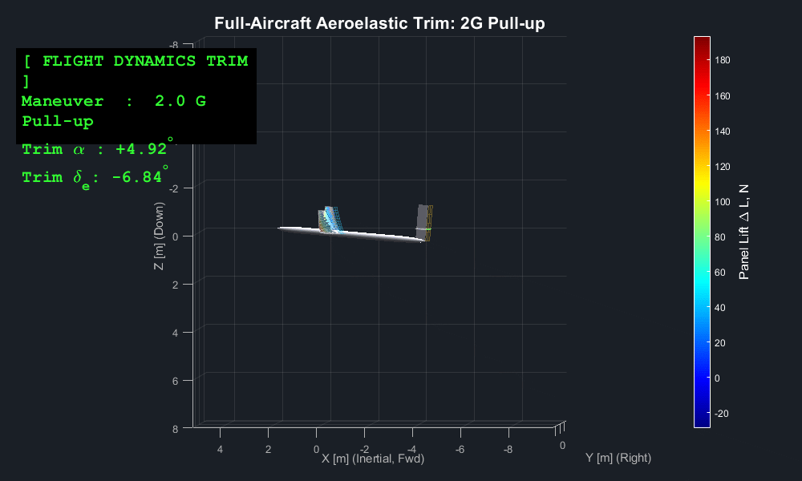
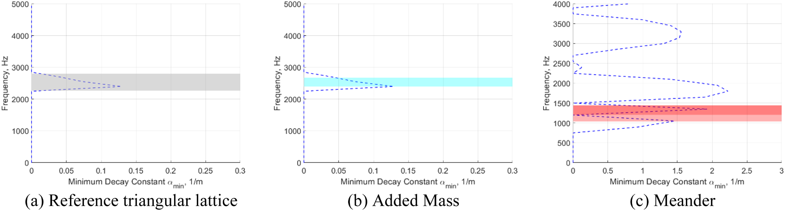
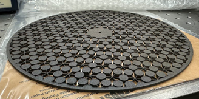
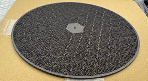
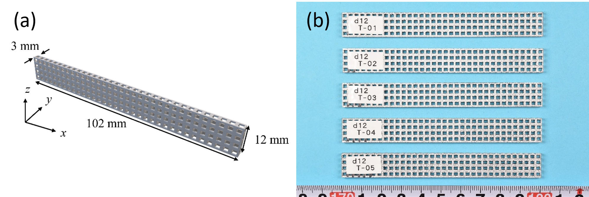
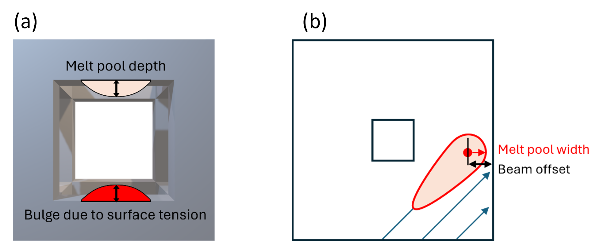
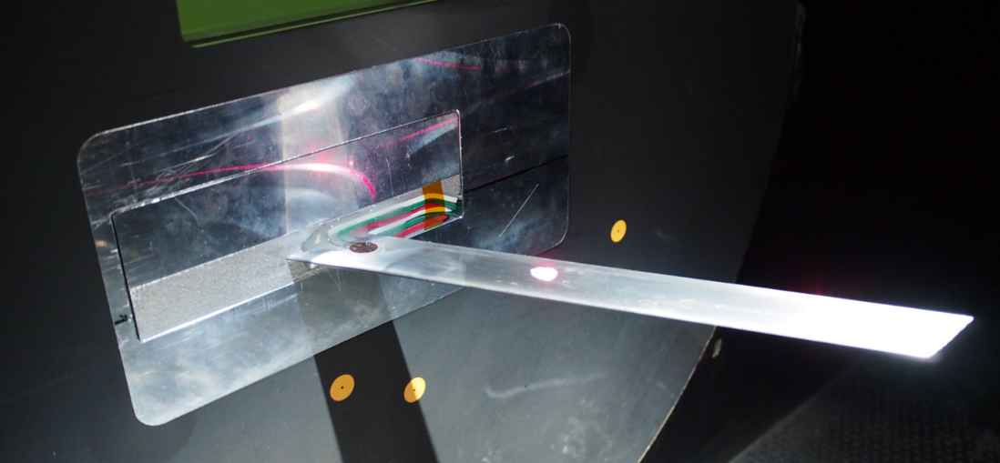
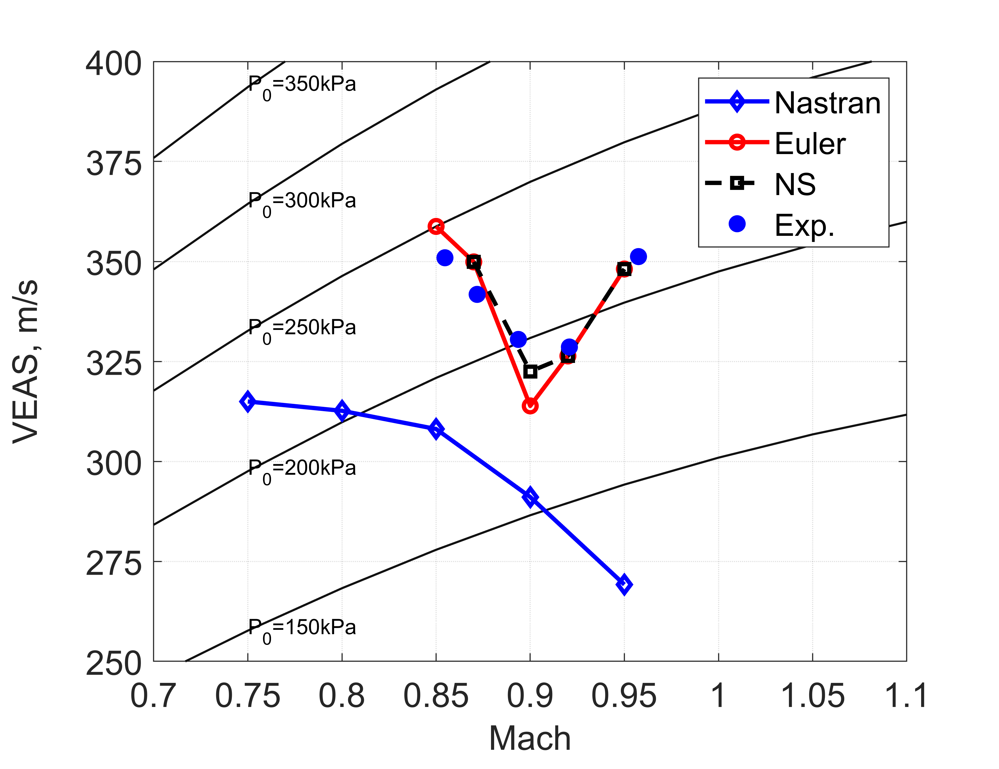
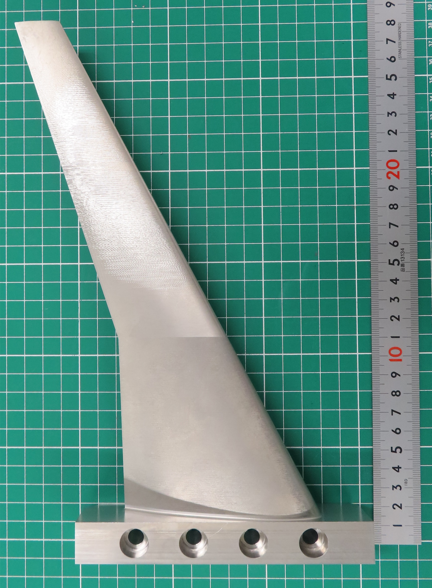
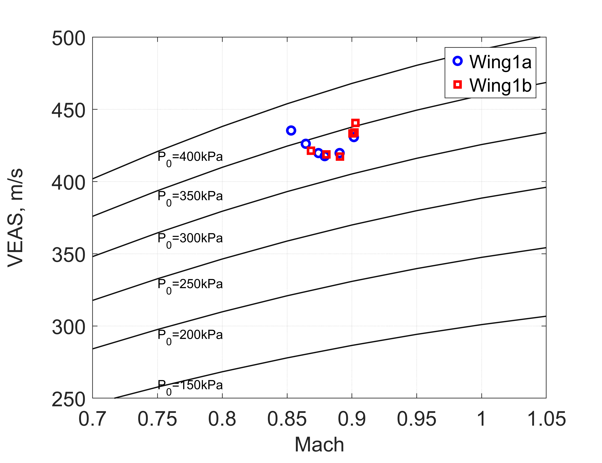

My research integrates computational mechanics, structural design, sensing, and experimental validation to address emerging challenges in aerospace structures.

## Nonlinear Aeroelasticity and Highly Flexible Wings

Highly flexible wings offer substantial aerodynamic and structural advantages but exhibit strong interactions among structural deformation, unsteady aerodynamic loading, and flight dynamics.

The research addresses nonlinear aeroelastic modeling, reduced-order analysis, computational simulation, and experimental validation for highly flexible aerospace systems.

{fig-align="center" width="90%"}

## Flutter Mechanism Diagnosis and Aeroelastic Tailoring

This research develops spatial and component-resolved methods for identifying the physical mechanisms that drive or suppress flutter.

A central topic is spatial aerodynamic work mapping, which provides a physically interpretable connection between unsteady aerodynamic forces, structural deformation, and flutter stability.

## Aerospace Mechanical Metamaterials

Mechanical metamaterials enable vibration and elastic-wave propagation to be controlled through deliberately designed internal architectures. My research integrates dispersion analysis, multiscale structural analysis, additive manufacturing, uncertainty quantification, and experimental validation to develop lightweight and multifunctional metamaterial structures for aerospace and mechanical systems.

A particular focus is the creation of low-frequency bandgaps in compact load-bearing structures. Complex dispersion analysis is used not only to identify the frequency ranges of bandgaps, but also to quantify how rapidly elastic waves decay inside the structures.

{fig-align="center" width="100%"}

The distributed Added Mass concept provides inertial tuning of the bandgap frequency while largely retaining the attenuation mechanism of the reference lattice. In contrast, the Meander concept uses spatially folded load paths to shift the bandgap toward lower frequencies and substantially increase the spatial decay rate, enabling strong vibration attenuation within a compact structural domain.

### Additively Manufactured Metamaterial Prototypes

The two vibration-control concepts were integrated into finite circular structures and fabricated from maraging steel using powder-bed-fusion additive manufacturing. The Added Mass design introduces distributed inertial elements at the lattice vertices, whereas the Meander design uses folded structural paths to reduce the effective stiffness and enhance low-frequency attenuation.

::: {layout-ncol="2"}

{width="100%"}

{width="100%"}

:::

The fabricated prototypes demonstrate the feasibility of realizing complex vibration-control architectures in compact load-bearing components. They also provide a platform for investigating the effects of manufacturing uncertainty, geometric deviation, and effective material-property degradation on practical attenuation performance.

::: {.figure-source}

**Figure sources:** Adapted from Figs. 9 and 14 in N. Tsushima, M. Ohishi, and T. Kasai, “Predicting low-frequency attenuation in additively manufactured mechanical metamaterials via complex dispersion analysis and uncertainty quantification,” *Journal of Sound and Vibration*, Vol. 642, 119970, 2026. https://doi.org/10.1016/j.jsv.2026.119970. Licensed under https://creativecommons.org/licenses/by-nc/4.0/. The original figures were separated, converted from TIFF to PNG, and resized for web presentation; no scientific content was altered.

:::

### Manufacturing-Aware Design of Metallic Lattice Structures

The mechanical performance of additively manufactured lattice structures depends not only on their nominal architecture but also on the geometrical fidelity of the as-built microstructure. Even small deviations in lattice-beam width and thickness can alter the effective stiffness, strength, and dynamic response of the resulting structure.

My research develops an integrated prediction framework that combines thermomechanical process simulation with melt-pool dimensions, surface-tension-induced bulging, and beam-offset effects. This approach captures local geometrical deviations that cannot be explained by thermal deformation alone.

::: {layout-ncol="2"}

{width="100%"}

{width="100%"}

:::

The resulting geometry predictions are used to optimize laser power, scanning speed, and beam offset for powder-bed-fusion fabrication. Experimental measurements of AlSi10Mg lattice specimens demonstrated substantial improvements in dimensional accuracy, with most optimized dimensions differing by less than 5% from the original CAD design.

Numerical homogenization and tensile testing are subsequently used to quantify how manufacturing-induced geometrical deviations affect the effective structural properties of lattice-based materials. This manufacturing-aware workflow connects process parameters, as-built geometry, and structural performance, supporting the reliable realization of aerospace mechanical metamaterials.

::: {.figure-source}

**Figure sources:** Figs. 3 and 11 reproduced without modification from N. Tsushima, M. Kita, I. Matsubara, M. Ohishi, K. Kaneko, K. Mitsui, T. Kanzawa, R. Higuchi, and K. Yamamoto, “Accurate geometrical prediction and process optimization of additively manufactured metallic lattice structures via integrated thermomechanical and melt pool analysis,” *The International Journal of Advanced Manufacturing Technology*, 2026. https://doi.org/10.1007/s00170-026-17692-8. Licensed under https://creativecommons.org/licenses/by-nc-nd/4.0/. The complete original figures are displayed side by side and resized only for web presentation; the scientific and graphical content has not been modified.

:::

## Additively Manufactured Wind-Tunnel Models

Wind-tunnel experiments remain indispensable for validating aeroelastic prediction methods and investigating complex fluid–structure interactions. My research develops additively manufactured wind-tunnel models that accurately reproduce structural and aeroelastic characteristics while significantly reducing fabrication cost and development time.

The work has evolved through three stages: geometrically nonlinear highly flexible wing models, transonic flutter wing models fabricated by metal additive manufacturing, and hybrid additive–subtractive manufacturing methods for highly reproducible aeroelastic experiments.

### Large-Deformation Aeroelasticity of Flexible 3D-Printed Wings

The development of additively manufactured aeroelastic models began with a highly flexible, high-aspect-ratio wing fabricated from thermoplastic material. The model provided a cost-effective and geometrically simple experimental platform for directly validating shell-based nonlinear aeroelastic analysis.

Wind-tunnel testing demonstrated that geometrically nonlinear effects become increasingly important as the deformation grows. At the highest test condition, the wing-tip displacement reached approximately 16% of the semi-span. The geometrically nonlinear prediction agreed with the experimental measurement within approximately 1.4%, whereas the linear solution showed an error of approximately 9.4%.

This study demonstrated both the feasibility of additively manufactured flexible wind-tunnel models and the importance of geometrically nonlinear analysis for highly flexible wings.

**Related publication:**  
N. Tsushima, M. Tamayama, H. Arizono, and K. Makihara, “Geometrically nonlinear aeroelastic characteristics of highly flexible wing fabricated by additive manufacturing,” *Aerospace Science and Technology*, Vol. 117, 106923, 2021. https://doi.org/10.1016/j.ast.2021.106923

### Transonic Flutter Models

The next stage of the research focused on transonic aeroelastic instabilities. Metal additive manufacturing using AlSi10Mg alloys was adopted to create dynamically representative flutter models capable of reproducing prescribed structural and modal characteristics while maintaining realistic aerodynamic geometries.

::: {layout-ncol="3"}

{width="100%"}

{width="100%"}

{width="100%"}

:::

The fabricated flutter wing models achieved dimensional accuracies within approximately 0.16 mm and average surface roughness around 1 μm. Static and modal experiments confirmed agreement with finite-element predictions, while transonic wind-tunnel testing successfully reproduced nonlinear aeroelastic phenomena including limit-cycle oscillation (LCO) and the transonic dip. The experiments provided direct validation data for high-fidelity aeroelastic simulations and demonstrated that metal additive manufacturing can be used to construct reliable flutter models for transonic testing.

::: {.figure-source}

**Figure source:** Figs. 1 and 32 reproduced without modification from N. Tsushima, K. Saitoh, and K. Nakakita, “Structural and aeroelastic characteristics of wing model for transonic flutter wind tunnel test fabricated by additive manufacturing with AlSi10Mg alloys,” *Aerospace Science and Technology*, Vol. 140, 108476, 2023. https://doi.org/10.1016/j.ast.2023.108476. Licensed under https://creativecommons.org/licenses/by-nc-nd/4.0/.

:::

### Reproducible Hybrid Manufacturing

Recent work has further extended the concept by systematically combining additive manufacturing and precision CNC machining. The objective is to improve geometrical accuracy, surface quality, and model-to-model reproducibility for aeroelastic testing.

::: {layout-ncol="2"}

{width="100%"}

{width="100%"}

:::

The hybrid manufacturing framework first fabricates near-net-shape wing models using powder-bed-fusion additive manufacturing and subsequently applies precision machining to critical aerodynamic surfaces and trailing edges. This process substantially reduces the variability associated with manual polishing while enabling systematic quality control.

The resulting wing models achieved average surface roughness below 1 μm and average surface deviations below 0.3 mm. Independent wing models fabricated using the same process exhibited flutter frequencies of 157 Hz and 158 Hz, demonstrating excellent repeatability of both structural and aeroelastic characteristics. This capability enables reliable uncertainty quantification, repeatable aeroelastic testing, and efficient validation of numerical simulation tools.

::: {.figure-source}

**Figure source:** Figs. 12 and 24 reproduced from N. Tsushima, K. Soneda, K. Saitoh, and K. Nakakita, “Construction of flexible wing models by combined manufacturing of additive and subtractive processes for transonic wind tunnel testing,” *Aerospace Science and Technology*, Vol. 167, 110665, 2025. https://doi.org/10.1016/j.ast.2025.110665. Licensed under https://creativecommons.org/licenses/by-nc/4.0/.

:::

## Structural Dynamics, Vibration Control and Sensing
## Structural Dynamics, Vibration Control and Sensing

This research area focuses on the prediction, control, and experimental identification of vibration and deformation in flexible aerospace structures. The work integrates nonlinear structural dynamics, piezoelectric transduction, active and passive vibration control, strain-based sensing, system identification, and structural shape reconstruction.

A central objective is to develop lightweight multifunctional structures that can simultaneously carry mechanical loads, monitor their dynamic state, suppress undesirable vibration, and support the validation of computational models. These technologies are applicable to flexible aircraft, launch vehicles, spacecraft structures, propulsion systems, and advanced composite or additively manufactured structures.

### Piezoelectric Aeroelastic Control and Energy Harvesting

My research on multifunctional flexible wings investigates the concurrent use of piezoelectric materials for structural actuation, passive shunt damping, vibration-energy harvesting, and aeroelastic stabilization.

A geometrically nonlinear electro-aeroelastic framework was developed to represent strongly coupled interactions among large structural deformation, unsteady aerodynamic loading, piezoelectric actuation, electrical energy conversion, and feedback control. Active flutter suppression was implemented using a Linear Quadratic Gaussian controller, while piezoelectric energy harvesters provided additional passive damping and converted residual structural vibration into electrical energy.

The studies demonstrated that highly flexible wings can be stabilized through an appropriate combination of active piezoelectric control near the wing root and passive damping or energy harvesting over the remaining span. This multifunctional approach provides a basis for adaptive aerospace structures that combine aeroelastic control, vibration suppression, sensing, and onboard energy management.

**Related publication:**  
N. Tsushima and W. Su, “Flutter suppression for highly flexible wings using passive and active piezoelectric effects,” *Aerospace Science and Technology*, Vol. 65, pp. 78–89, 2017. https://doi.org/10.1016/j.ast.2017.02.013

### Vibration Monitoring of Flexible Launch Vehicles

In collaborative research involving researchers from NASA Kennedy Space Center, the University of Alabama, Florida Institute of Technology, and a.i. solutions, strain-instrumented reference structures were investigated for monitoring the multi-axial vibration of flexible launch vehicles.

The concept uses removable reference strain structures attached longitudinally to a launch-vehicle surface. Distributed strain sensors installed on these structures indirectly track the bending and torsional deformation of the vehicle. A surrogate-based multi-objective optimization framework was developed to determine the structural dimensions, attachment configuration, and sensor spacing required for accurate deformation reconstruction while avoiding undesirable dynamic interaction with the launch vehicle.

Transient numerical studies demonstrated accurate reconstruction of multi-axial bending deformation under different excitation frequencies and loading directions. The modular sensing concept provides a pathway toward structural-state estimation, vibration monitoring, experimental modal identification, and the future integration of flexible-vehicle dynamics with guidance and control systems.

**Related publication:**  
N. Tsushima, W. Su, H. Gutierrez, M. G. Wolf, E. D. Griffin, J. T. Whittaker, and M. P. Dumoulin, “Monitoring multi-axial vibrations of flexible rockets using sensor-instrumented reference strain structures,” *Aerospace Science and Technology*, Vol. 71, pp. 285–298, 2017. https://doi.org/10.1016/j.ast.2017.09.026

### Strain-Based Shape Sensing for Aeroelastic Testing

Recent international collaboration with the DLR Institute of Aeroelasticity has extended strain-based structural monitoring to additively manufactured wing models for transonic wind-tunnel testing.

The research investigates how sparse arrays of strain measurements can be integrated into swept and tapered wing models and used to reconstruct bending deformation and twist. Ko’s displacement theory provides a computationally efficient relationship between distributed strain measurements and structural shape without requiring direct knowledge of the complete loading distribution.

Numerical studies demonstrated that the approach can accurately reconstruct the deformation of swept and tapered wings with unsymmetric supercritical airfoils. For a representative transonic wing model, the reconstructed bending deflections showed errors below 1%, while the average error in the predicted twist remained below 5%.

The integrated sensing concept supports real-time deformation monitoring, experimental aeroelastic identification, model validation, and the development of smart wind-tunnel models with embedded or surface-integrated sensing systems.

**Related publication:**  
N. Tsushima, H. Mai, M. Braune, and T. Buete, “Shape identification of a wing model by additive manufacturing for transonic wind tunnel testing,” *International Forum on Aeroelasticity and Structural Dynamics 2024*, IFASD-2024-200, The Hague, The Netherlands, 2024.